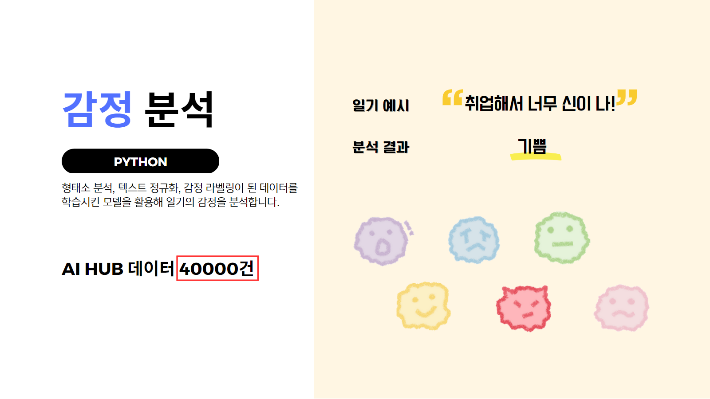
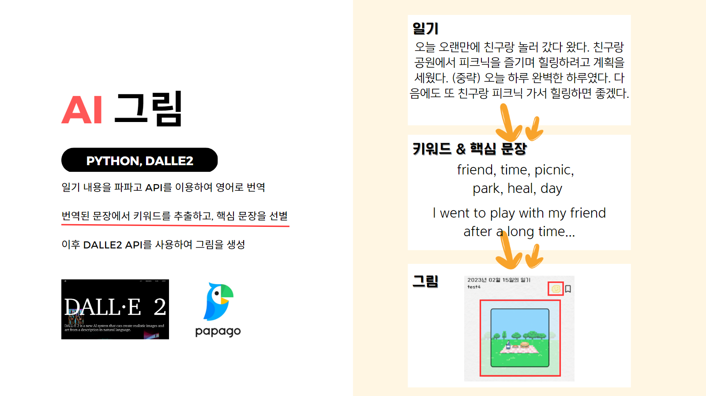
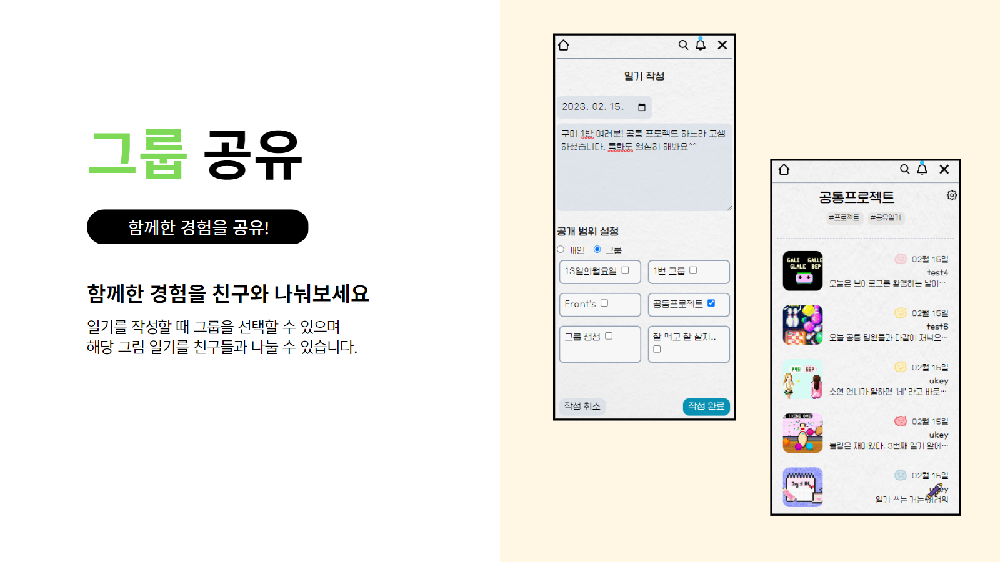

## ✨ 프로젝트 진행 기간

2023.01.09 (월) ~ 2023.02.17 (금) _ (6주간 진행)

SSAFY 8기 2학기 공통 프로젝트 - **DBD 나날**

## ✨ 팀원 소개


## ✨ 기획 배경

현재의 소셜미디어는 보여주기식 게시글과 광고성 글들이 많아 사용자에게 피로감을 주고 있습니다.

최근 1020 세대들은 자신의 솔직한 감정을 기록하거나 현실적인 일상을 공유하는 등 이전과는 다른 새로운 트렌드를 선보이고 있습니다.

특히, 지난해 네이버 블로그팀은 "주간 일기 챌린지"을 진행했는데, 약 200만개의 블로그가 새로 생성되었고, 챌린지의 70% 이상이 10대~30대임을 확인하면서 MZ세대들에게 큰 호응을 이끌어 냈습니다. 이에 카카오도 일상 기록 서비스를 출시하겠다고 밝히면서 새로운 SNS의 필요성이 증가하고 있음을 알 수 있습니다.

그래서 저희는 보여주기식 SNS가 아닌 본인의 진솔한 이야기를 담아 소통할 수 있는 "나날"이라는 일기 서비스를 제작했습니다.

## ✨ 서비스 개요

친구와 손쉽게 나의 일상을 공유할 수는 없을까?
나의 일상을 좀 더 진솔하게 기록할 수는 없을까?
나의 일상을 좀 더 특별히 기록할 수 있는 방법은 무엇일까?

‘나날’은 나날이를 의미하는 단어입니다.

일기를 나날이 써보자, 나의 일상을 나날이 좀 더 특별히 기록해보자, 친구와 나의 나날을 공유해보자와 같은 의미를 지니고 있습니다.

‘나날’은 일기을 기록하고 그림을 만들어주며 친구와 공유할 수 있는 웹 서비스 입니다.

AI를 통하여 일기의 내용을 그림으로 그려주기도 하며, 그날의 감정을 분석하여 사용자에게 알려줌으로서 나의 일상을 좀 더 특별히 기록이 가능합니다. 또한, 이러한 일기들을 친구들과 손쉽게 공유하는 장을 제공함으로써 교환 일기의 플랫폼을 제공하고 있습니다.

## ✅ 주요 기능

### - 자연어 처리를 통한 감정 분석



- 감정은 총 6 개(슬픔, 기쁨, 보통, 당황, 화남, 불안)로 분류하며 그 중 1개의 이모티콘으로 표현됩니다.
- 분석 방법으로는 4만건의 데이터를 받아와 형태소 분석, 텍스트 정규화, 감정 라벨링을 통해 전처리를 진행했습니다.
  이후 학습시킨 모델을 활용해 사용자가 작성한 일기에서 감정을 분석합니다.

### - 자연어 처리를 통한 핵심 문장 추출



- 유저가 일기만 작성하면 일기 내용을 자동으로 파파고가 영어로 번역하며, 번역한 문장에서 키워드를 추출하고, 핵심 문장을 선별합니다. 이때 핵심 문장은 작성된 일기의 양에 따라 여러 개가 나올 수도 있습니다.
- 핵심 문장 추출 과정
  1. 일기 300자 이내 작성
  2. 파파고 API 통해 영어로 번역
  3. 전처리(단어 토큰화/ 명사, 동사 원형 복원/ 불용어 처리)
  4. 단어 빈도수로 뽑기 (빈도수 2이상)
  5. 문장 중에서 4)에서 뽑은 단어가 많이 나오는 문장 뽑기
     (여러 문장 가능하며 문장 길이에 따라 문장 수는 달라짐)

### - 교환일기를 쓸 수 있는 공유 플랫폼 제공



- 일기를 작성할 때 본인이 속한 그룹을 다중 선택할 수 있으며 해당 일기를 친구들과 나눌 수 있습니다.
- 해당 그룹 내 인원들끼리만 댓글을 주고 받을 수 있어 함께한 사람들과의 추억을 나눌 수 있습니다.

## ✅ 주요 기술

**Backend - Spring**

- IntelliJ IDE
- Springboot Gradle 6.8.3
- Java jdk corretto 11.0.17
- Spring Data JPA
- Spring Security 5.6.1
- Spring Validation 2.5.6
- Spring Web
- Swagger 2.7.7
- Lombok

**Backend - DB**

- MariaDB 10.10.2
- Amazon S3

**Backend - Flask**

- python 3.9
- java-1.7-openjdk
- Scikit-learn 1.0.2
- openai 0.26.5
- nltk 3.8.1
- pandas 1.5.3
- konlpy
- JPype1==1.4.1

**Frontend - React**

- Visual Studio Code IDE
- Nodejs 18.12.1
- React 18.2.0
- TailwindCss
- sweetalert2 11.3.10
- axios 1.2.3

**CI/CD**

- AWS EC2
  Ubuntu 20.04
  Docker 20.10.23
- Jenkins
- NGINX
- SSL

## ✅ 프로젝트 파일 구조

<details>
<summary>back_Nanal</summary>
<div markdown="1">

  ```
  📦nanal
 ┣ 📂config
 ┃ ┣ 📂common 
 ┃ ┣ 📂oauth  
 ┃ ┣ 📂security  
 ┣ 📂controller  
 ┣ 📂dto  
 ┣ 📂exception    
 ┣ 📂handler    
 ┣ 📂model  
 ┣ 📂PapagoAPI  
 ┣ 📂repository  
 ┣ 📂S3Uploader  
 ┣ 📂service
 ┗ 📜NanalApplication.java
  ```
  </div>
</details>

<details>
  <summary>front_Nanal</summary>
    <div markdown="1">

  ```
    📦src
    ┣ 📂components
    ┃ ┣ 📂account
    ┃ ┣ 📂another
    ┃ ┣ 📂diary
    ┃ ┣ 📂friend
    ┃ ┣ 📂group
    ┃ ┣ 📂mypage
    ┃ ┃ ┣ 📂profile
    ┃ ┃ ┣ 📂setting
    ┣ 📂config
    ┣ 📂main
    ┣ 📂src_assets
    ┃ ┣ 📂css
    ┃ ┣ 📂fonts
    ┃ ┗ 📂img
    ┃ ┃ ┣ 📂bookmark
    ┃ ┃ ┣ 📂bookmark-name
    ┃ ┃ ┣ 📂diary-img
    ┃ ┃ ┣ 📂emotion
    ┣ 📂store
    ┣ 📂webComponents
    ┃ ┣ 📂account
    ┃ ┣ 📂another
    ┃ ┣ 📂diary
    ┃ ┣ 📂friend
    ┃ ┣ 📂group
    ┃ ┣ 📂modal
    ┃ ┣ 📂setting
    ┣ 📜App.css
    ┣ 📜App.js
    ┣ 📜index.css
    ┣ 📜index.js
  ```

  </div>
  </details>
  
<details>
  <summary>flask_Nanal</summary>
    <div markdown="1">
    </div>
  </details>

      
      
## ✅ 프로젝트 산출물 및 결과물

GitLab 및 exec 폴더 참조
